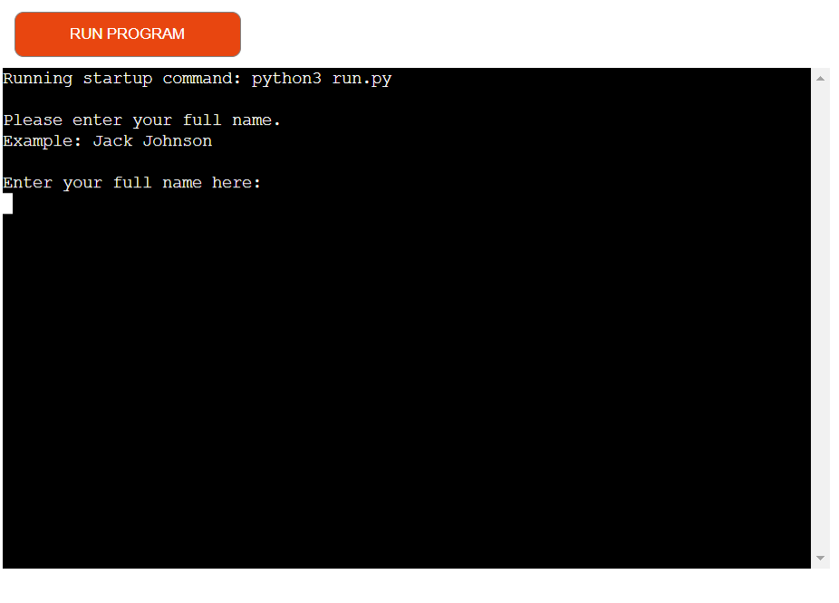
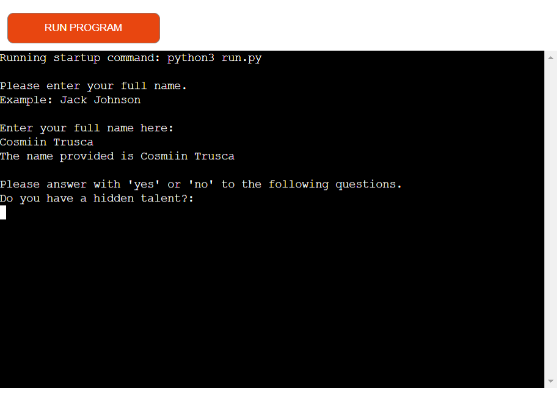
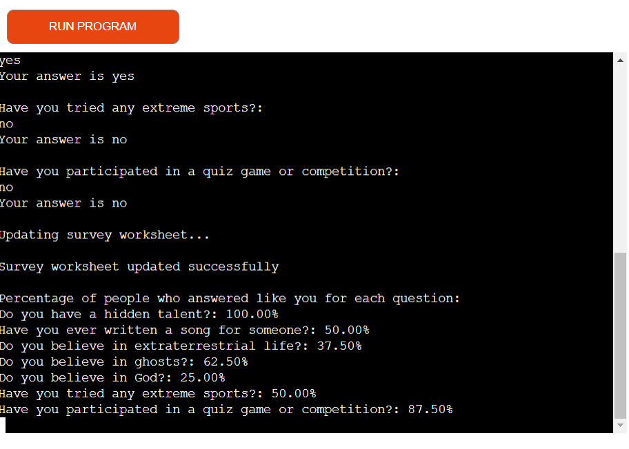

# Smart Survey

This survey application is designed to seamlessly collect and process user responses using Google Sheets. The app prompts participants to enter their full name and respond to a series of questions with 'yes' or 'no' answers. It ensures data integrity by validating the format of the entered names and responses, allowing only properly formatted names and valid answers. The survey includes diverse questions ranging from personal experiences to beliefs, making it a versatile tool for gathering a wide array of information.

Once the data is collected, the application updates a Google Sheets worksheet with the new responses. It then calculates and displays the percentage of participants who answered similarly to the current respondent for each question, providing immediate feedback on how their answers compare with those of others. This functionality not only facilitates data collection but also offers valuable insights into common trends and opinions among the survey participants.

The example questions are designed to explore the aspirations, preparedness, and ambitions of high school students as they look toward their future. By asking whether students plan to attend college or pursue careers in STEM, we gain insight into their educational and professional goals. Questions about their preparedness for the job market and interest in entrepreneurship reveal their confidence and potential for innovation. Evaluating their perception of their high school education's adequacy provides a measure of how well they feel supported in achieving their goals. Inquiring about studying or working abroad indicates their openness to global opportunities, while asking about their career longevity in a single field helps understand their expectations for professional stability and growth. Together, these questions offer a comprehensive view of how high school students envision their future paths.

## Features

This website is ideal for researchers, educators, and organizations seeking to gather and analyze survey data efficiently. It caters to users who need a reliable tool for collecting responses, ensuring data validity, and providing instant statistical insights. By leveraging the Google Sheets API, the project offers a streamlined and user-friendly solution for survey management, making it the best choice for those who want to achieve accurate and insightful survey results with minimal effort.

### Existing Features

- _Google Sheets API Setup_

    - This section initializes the connection to Google Sheets using OAuth credentials. It allows the app to securely access and modify the survey data stored in Google Sheets, ensuring that data management is both efficient and secure.

- _Validation Functions_

    - The functions is_valid_name and is_valid_answer validate user inputs. These functions ensure that only properly formatted names and valid 'yes' or 'no' answers are accepted, enhancing data accuracy and reliability.

- _Data Collection Function_

    - The get_survey_data function collects the user's name and survey responses, prompting for corrections if the input is invalid. This feature is crucial for maintaining the integrity of the survey data and providing a seamless user experience.

- _Worksheet Update Function_

    - The update_survey_worksheet function appends new responses to the Google Sheets worksheet and calculates the percentage of similar answers. This feature provides users with immediate feedback on how their responses compare with others, adding an interactive and informative element to the survey process.

### How does the app work ?

- _First, you need to enter your name._

- _After that you will need to answer the questions._

- _At the end, the worksheet will get updated and you will be shown the statistics of the ansers from other participants_

## Testing

To ensure the survey application functions correctly, I conducted comprehensive testing that included configuration verification, input validation, and data handling. The Google API credentials were confirmed to be correctly set up, and access to the appropriate Google Sheets document and worksheet was verified. Validation functions for names and answers were tested with various valid and invalid inputs to ensure robustness. Simulated user interactions confirmed accurate data collection and entry into the worksheet. Percentage calculations were manually cross-checked with sheet data to ensure accuracy. The script was also tested for error handling and resilience, ensuring it provided clear feedback and handled invalid inputs gracefully. Finally, end-to-end testing with multiple user entries confirmed the application's seamless and reliable performance.

### Validator Testing

No errors were returned when passing through the official [CI Python Linter](https://pep8ci.herokuapp.com/)

## Deployment

- _The site was deployed to heroku. the steps to deploy are as follows:_
    - Firs you need to create a new app on horoku
    - After that you need to go to the settings of your app and add 2 config vars:
        - Key: PORT and Value: 8000
        - Key: CREDS and Value: copy of the "creds.json" file
    - After adding the config vars you will add 2 buildpacks: python and nodejs
    - Then you go to deployment and choose to deploy from GitHub
    - At the and you will only need to click the deploy button

## Credits

This project draws inspiration and technical guidance from the "Love Sandwiches" project. The methodologies and techniques utilized in connecting to Google Sheets, managing OAuth credentials, and validating user inputs have been adapted and refined based on the foundational work established by the Love Sandwiches project.